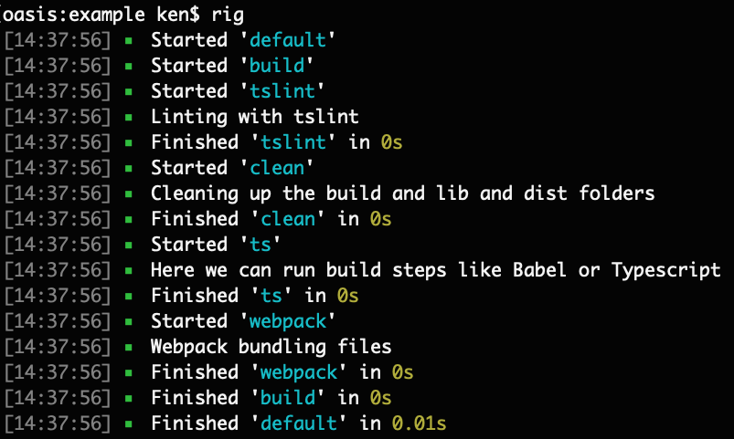
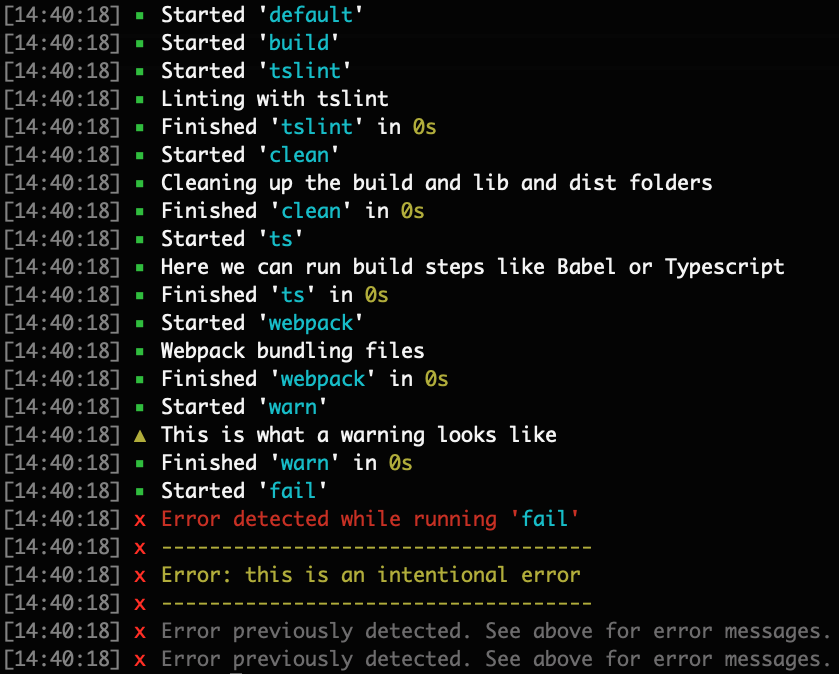

`just-task` is simple, but it is opinionated. One of the built-in capabilities of `just-task` is logging. We feel that this is an important enough of a feature to be available by the library.

Typically, logging tasks look like the following:



## Usage

To log within the task, simply use the `info()` function off of the `logger` object inside a task function.

```js
const { task, logger } = require('just-task');

task('needsLogging', function () {
  logger.info('log something');
});
```

If you want to log an error or warning do it with the `logger` object's `warn()` and `error()` functions. It looks like this following:



```js
const { task, logger } = require('just-task');

task('needsLogging', function () {
  logger.warn('a warning');
  logger.error('an error');
});
```

If your error is meant to stop the tasks, simply throw an Error:

```js
const { task, logger } = require('just-task');

task('needsLogging', function () {
  throw new Error('an error');
});
```
